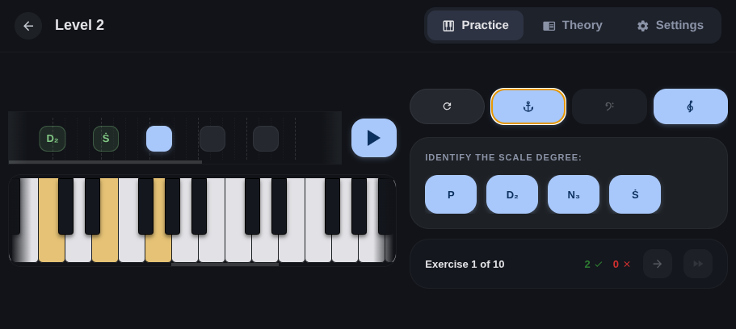
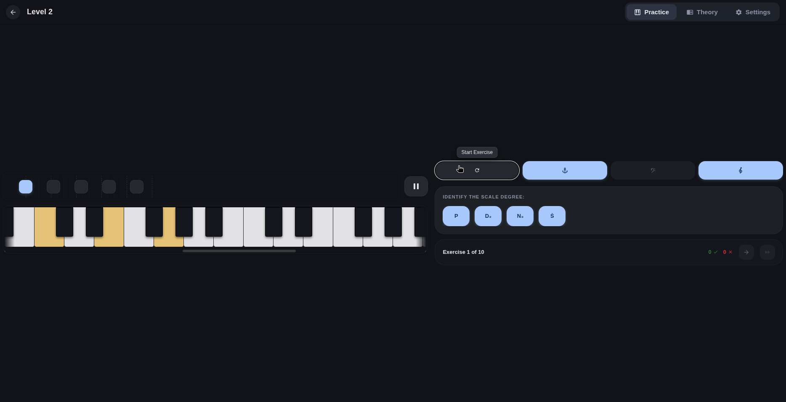
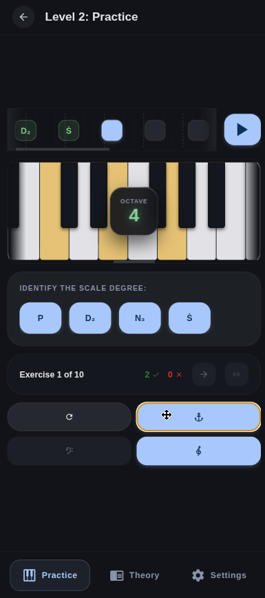

#  Play by Ear

A modern, highly interactive, and beautiful MIDI-based ear training application built with **React Native**, **Expo**, and **ToneJS**. Designed to train your musical ear through structured levels, interactive keyboard visualizers, dynamic timelines, and comprehensive feedback modes.

*Theory is a work in progress, please feel free to raise PRs to improve the quality of notes provided. The primary maintainer is self taught and may have made mistakes.*

---

## Screenshots

  

📷 View Other Views (Browser & Portrait)

 

### Landscape Browser

### Portrait View

---

## Discussing features
Request features using the Issues tab. There is no Discord for discussion - use the Discussion tab if you wish to discuss anything.
The roadmap and TODO list are maintained in [TODO.md](./TODO.md).

> [!IMPORTANT]
> This repo will not accept pull requests of greater than 50 lines without prior communication with the maintainer. This has been done to reduce review burden.

Development instructions and codebase architecture are maintained in [DEVELOPMENT.md](./DEVELOPMENT.md).

## 🤖 AI Agent Guidelines

This repository includes a dedicated [AGENTS.md](./AGENTS.md) file containing strict instructions, architectural requirements, and coding standards. 

If you are pair-programming with AI assistants, ensure they are prompted to read and adhere to [AGENTS.md](./AGENTS.md) before writing any code.

---

## Asset Attributions

This project uses the following high-quality, open-source graphic assets:
- **Treble Clef Vector Shape**: Pulled from [Wikimedia Commons - File:Treble clef.svg](https://commons.wikimedia.org/wiki/File:Treble_clef.svg). This asset was originally uploaded by user *Tlusťa* and has been released into the **Public Domain (CC0 / MIT compatible)**.
- **Launcher Icons & Favicons**: Custom-rendered in high fidelity onto Material 3-inspired glowing gradients using our standard asset builder pipeline.
- **Classical & Traditional MIDI Presets**: Public domain MIDI files (including works by J.S. Bach, L. van Beethoven, A. Vivaldi, and traditional/holiday arrangements) sourced from public domain archives (such as [Musopen](https://musopen.org/) and the [Mutopia Project](https://www.mutopiaproject.org/)) under CC0 / Public Domain Mark.
- **Grand Piano Audio Samples**: Sourced from the [gleitz/midi-js-soundfonts](https://github.com/gleitz/midi-js-soundfonts) repository, utilizing the FluidR3_GM acoustic grand piano MP3 soundfont.